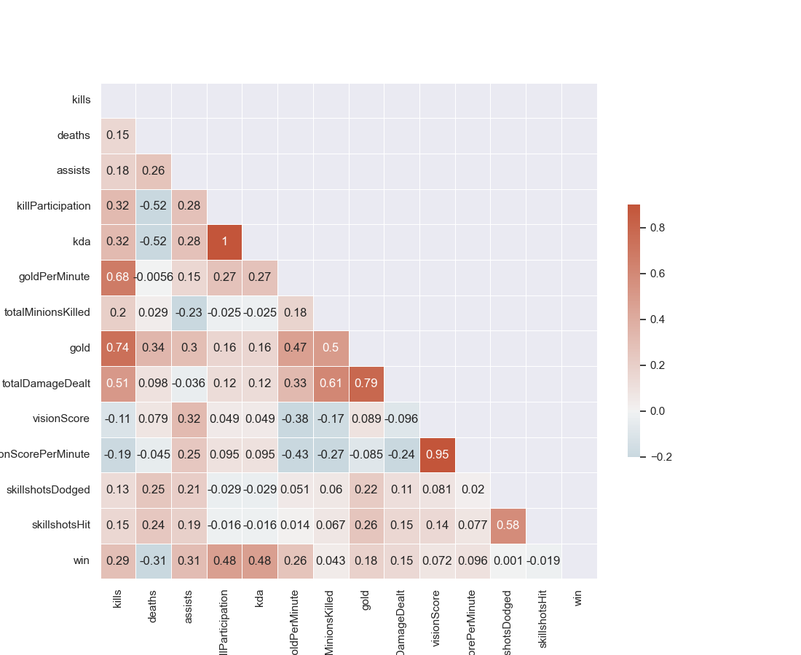
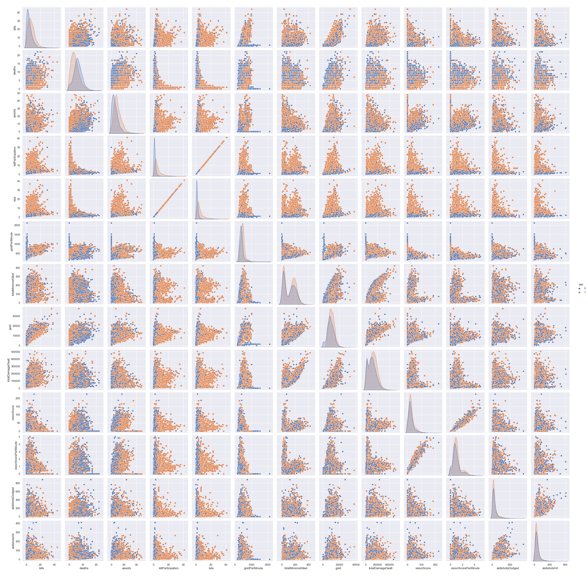
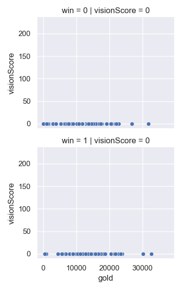

# Overview

eSports has been a growing industry with revenues expected to reach $1,084 million, representing a year-on-growth of 14.5%. The combined esports market together with games streaming is expected to be worth $2.1 billion in 2021 and more than $3.5 billion by 2025.\
Just like any other sport, there are several elements within the game that contribute to the outcome of the game and wether the team wins or lose. This analysis focuses on using machine learning to create a model on data collected from Riot Game's developer api to predict the outcome of a match. \

# Data Understanding

The data used for this project was obtained from the Riot API using their developer platform, I have also uploaded the same dataset on kaggle and can be found using [this](https://www.kaggle.com/pratimanjoshi/euw-challanger-gamestats) link. It includes data from challenger level competitive matches with 13 features per player and one target variable which indicates whether the match resulted in a win or loss for the player.

<b>Glossary of Features:</b>
- Kills: Total number of kills the player have gotten during the span of a game.
- Deaths: Total times the player died in the game.
- Assists: Contributing to a kill by providing damage or utility.
- KillParticipation: This statistic is calculated for a player by taking their kills plus assists and dividing that by their team's total kills.
- Kda: This statistic refers to the players Kills, Deaths and Assists ratio.
- goldPerMinute: This statistic holds the value of the gold that the player earned every minute in the game. 
- totalMinionsKilled: This is the value of the total creeps the player killed by the end of the game.
- gold: This statistic refers to the value of the total gold the player had by the end of the game.
- totalDamageDealt: This is the value of the total damage the player dealt during the 
- visionScore: This statistic indicates how much vision a player has influenced in the game, this also includes the vision they provided and denied.
- visionScorePerMinute: This statistic provides the vision score of the player with respect to time.
- skillshotsDodged: This is a fairly new metric present within the 'challange' metric in the riot match api. This provides the number of skillshots dodged by the player.
- skillshotsHit: Similar to skillshotsdoged, skillshotshit is a metric to show how many skillshots a player hit.
- win: The final metric which tells the result of the player's game.

# Data Analysis
To begin with I started with a cross-correlation matrix as it provides a qualitative analysis of the correlation between the data, I used the 'Pearson Correlation Coefficient'. Now we have a linear relationship between two different variables.
For starters, we can find that there is a direct relationship between gold earned by the player and the kills they have gained. This is a true observation, as every kill grants the player at least 300 gold and increases if there is a bounty on the enemy killed.
Same relation is found between the total damage dealt, kills and gold earned. But after a thorough analysis of the corelation matrix, more insights of the game can be gained. \
For example, the game has a lane system, in which each player is assigned a lane, other than the jungle role. Support is a role which helps the players by planting vission, controlling the map and providing utility, as such they only gain their gold through assists. They are also mostly responsible for planting vission, whcih is why vission score has a negative relation with gold, kills and minions killed.
In a similar manner, most gold is funneled towards the 'carry' of the team, or the 'adc' (players who deal consistent and high damage) who also happen to take most kills, so we find a strong relation between gold and kills.\

For better understanding of the data, we also vizualized more relationship between the data items present in the dataset. Here is a pairplot, plotted using the seaborn library. Here, the data is in relation with all the dataitems present, with two different outcomes of the game. Loss, plotted as a blue circle and win, plotted as an orange square.\

This by no means is the clear picture of the game state, as different players play different roles. Such as the example of a support player we discussed above, who don't really earn any gold, nor do they have much on the 'minionsKilled' or 'gold' statistic or with other roles which do not contribute towards overall 'vision' statistic in the game. 
More such inferences can be taken by indepth analysis of the data. Since I am already an avid player of the game (totally not addicted) and follow the professional analysts, I understand to a certain degree the relations between these different statistics.

For example, the relation mentioned above with gold and vision score. I experimented with more such relations and found what features I can use for the final model that is to be created.

# Methods
